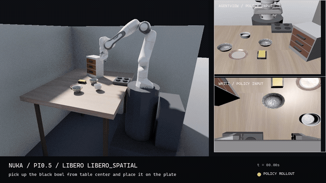
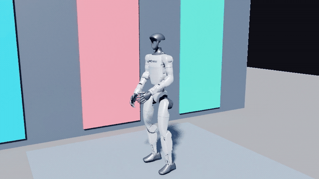
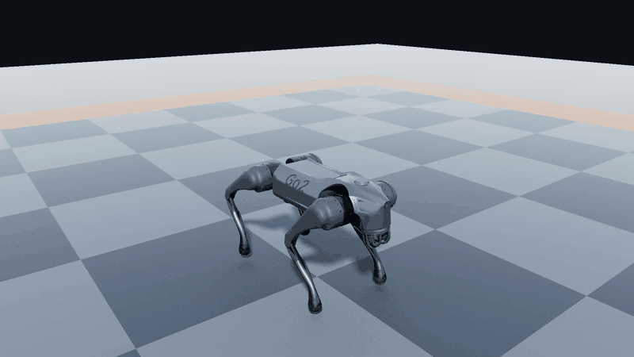
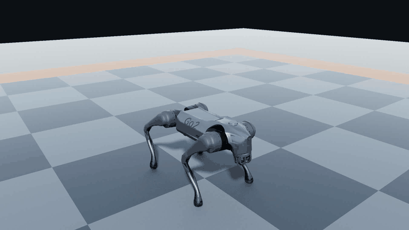
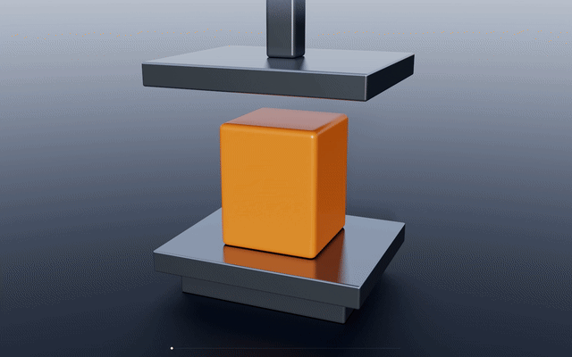
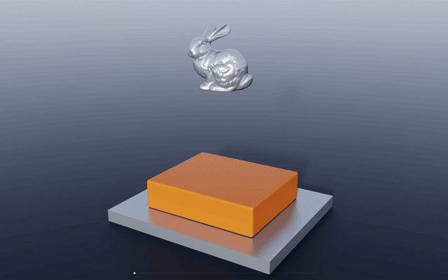
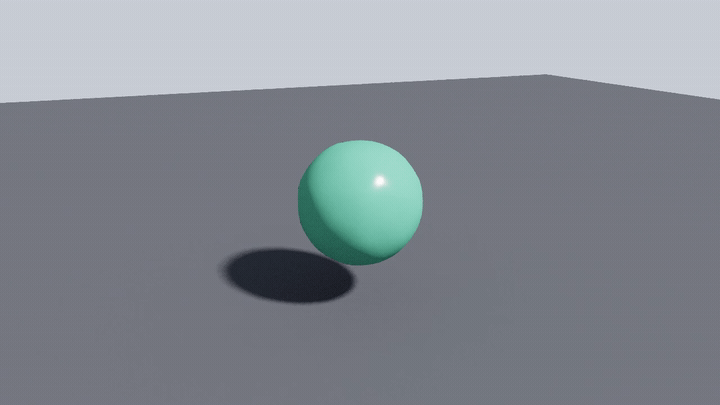
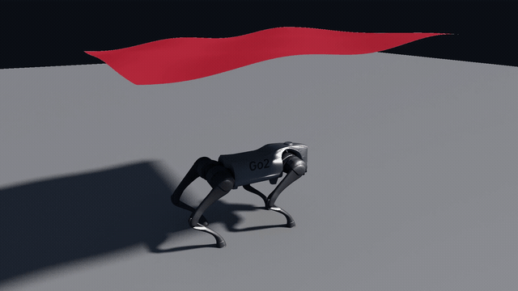

<p align="center">
  <picture>
    <source media="(prefers-color-scheme: dark)" srcset="docs/media/nuka-logo-light.png">
    
  </picture>
</p>

<h1 align="center">Nuka-Physics</h1>

<p align="center">
  <strong>GPU-resident, bit-deterministic, differentiable CUDA physics.</strong><br>
  One general solver for articulated robots, rigid bodies, cloth, soft bodies, and fluids.
</p>

<p align="center">
  
  
  
</p>

<p align="center">
  <a href="#quick-start">Quick start</a> ·
  <a href="examples/demo/README.md">Run the demos</a> ·
  <a href="docs/getting-started.md">Documentation</a> ·
  <a href="#architecture">Architecture</a>
</p>

<table align="center" width="100%">
<tr>
<td width="50%" align="center" valign="top">
  <a href="https://github.com/kry4r/Nuka-Physics/raw/master/docs/media/pi05_libero.mp4"></a>
  <br><b>π0.5 Inference</b>
  <br>Vision-language-action · LIBERO pick and place
  <br><a href="https://github.com/kry4r/Nuka-Physics/raw/master/docs/media/pi05_libero.mp4">Full video</a> · <a href="examples/demo/README.md#pi05-inference">Run demo</a>
</td>
<td width="50%" align="center" valign="top">
  <a href="https://github.com/kry4r/Nuka-Physics/raw/master/docs/media/g1_dance.mp4"></a>
  <br><b>G1 Dance</b>
  <br>29-DoF humanoid · Shuffle policy inference
  <br><a href="https://github.com/kry4r/Nuka-Physics/raw/master/docs/media/g1_dance.mp4">Full video</a> · <a href="examples/demo/README.md#g1-dance">Run demo</a>
</td>
</tr>
<tr>
<td width="50%" align="center" valign="top">
  <a href="https://github.com/kry4r/Nuka-Physics/raw/master/docs/media/nuka_go2_backflip.mp4"></a>
  <br><b>Go2 Double Backflip</b>
  <br>TorchScript policy inference
  <br><a href="https://github.com/kry4r/Nuka-Physics/raw/master/docs/media/nuka_go2_backflip.mp4">1080p video</a>
</td>
<td width="50%" align="center" valign="top">
  <a href="https://github.com/kry4r/Nuka-Physics/raw/master/docs/media/nuka_go2_front_handstand.mp4"></a>
  <br><b>Go2 Handstand</b>
  <br>TorchScript policy inference
  <br><a href="https://github.com/kry4r/Nuka-Physics/raw/master/docs/media/nuka_go2_front_handstand.mp4">1080p video</a>
</td>
</tr>
<tr>
<td width="50%" align="center" valign="top">
  <a href="https://github.com/kry4r/Nuka-Physics/raw/master/docs/media/elastoplastic_compression.mp4"></a>
  <br><b>Elastoplastic Compression</b>
  <br>Elastic recovery · Permanent deformation
  <br><a href="https://github.com/kry4r/Nuka-Physics/raw/master/docs/media/elastoplastic_compression.mp4">Full video</a> · <a href="examples/demo/README.md#elastoplastic-compression">Run demo</a>
</td>
<td width="50%" align="center" valign="top">
  <a href="https://github.com/kry4r/Nuka-Physics/raw/master/docs/media/elastoplastic_bunny.mp4"></a>
  <br><b>Bunny × Elastoplastic</b>
  <br>Free fall · Plastic indentation
  <br><a href="https://github.com/kry4r/Nuka-Physics/raw/master/docs/media/elastoplastic_bunny.mp4">Full video</a> · <a href="examples/demo/README.md#bunny-elastoplastic-impact">Run demo</a>
</td>
</tr>
<tr>
<td width="50%" align="center" valign="top">
  <a href="https://github.com/kry4r/Nuka-Physics/raw/master/docs/media/bunny_water_drop.mp4"></a>
  <br><b>Bunny × Water</b>
  <br>Two-way MLS-MPM coupling
  <br><a href="https://github.com/kry4r/Nuka-Physics/raw/master/docs/media/bunny_water_drop.mp4">Full video</a>
</td>
<td width="50%" align="center" valign="top">
  <a href="https://github.com/kry4r/Nuka-Physics/raw/master/docs/media/jelly_ball_drop.mp4"></a>
  <br><b>Elastic Jelly</b>
  <br>Deterministic MLS-MPM elasticity
  <br><a href="https://github.com/kry4r/Nuka-Physics/raw/master/docs/media/jelly_ball_drop.mp4">Full video</a>
</td>
</tr>
<tr>
<td width="50%" align="center" valign="top">
  <a href="https://github.com/kry4r/Nuka-Physics/raw/master/docs/media/go2_climb_terrain.mp4"></a>
  <br><b>Go2 Terrain</b>
  <br>RL locomotion · Procedural terrain
  <br><a href="https://github.com/kry4r/Nuka-Physics/raw/master/docs/media/go2_climb_terrain.mp4">1080p video</a>
</td>
<td width="50%" align="center" valign="top">
  <a href="https://github.com/kry4r/Nuka-Physics/raw/master/docs/media/go2_cloth_drape.mp4"></a>
  <br><b>Cloth × Go2</b>
  <br>Two-way body-particle coupling
  <br><a href="https://github.com/kry4r/Nuka-Physics/raw/master/docs/media/go2_cloth_drape.mp4">1080p video</a>
</td>
</tr>
</table>

## Why Nuka

- **GPU-resident at scale.** One cooked world template drives thousands of independent environments on one GPU.
- **D1 deterministic.** Fixed reduction order and no floating-point atomics produce byte-for-byte repeatable runs.
- **Differentiable.** Analytical reverse-mode adjoints cover rigid and articulated dynamics with PyTorch and JAX interop.
- **One contact path.** Robot-ground, robot-object, rigid-particle, and continuum coupling share the same solver architecture.
- **Self-written stack.** CUDA physics, importers, Vulkan rendering, and a CUDA path tracer, with no external physics or rendering SDK.

## Architecture

<p align="center">
  
</p>

| Layer | Core modules | Responsibility |
| --- | --- | --- |
| Authoring | `scene`, `import` | NKS, MJCF, URDF, and text-USD → SceneIR → cooked model |
| Simulation | `nk`, `collision`, `constraint` | GPU world, broadphase, narrowphase, universal rows, deterministic solve |
| Systems | `diffsim`, `sensor`, `codegen` | Reverse-mode adjoint, sensor queries, generated forward/adjoint kernels |
| Platform | `phi`, `render`, `rt` | CUDA backend, Vulkan raster, CUDA path tracer |

## Capabilities

| System | Status |
| --- | --- |
| Rigid + articulated dynamics (Featherstone / ABA) | Production |
| General contact + terrain / heightfields | Production |
| XPBD cloth and soft bodies | Functional |
| PBF fluid and MLS-MPM continuum | Functional |
| Two-way rigid / articulation / particle coupling | Functional |
| Differentiable rigid + articulated simulation | Functional, contact-free |
| Batched RL, PyTorch, JAX, DLPack | Functional |
| Vulkan raster + CUDA path tracing | Functional |

## Quick Start

Linux, CUDA 12.8, g++-10, and a CUDA-capable GPU are required.

```bash
export CC=gcc-10 CXX=g++-10
cmake -S . -B build-cuda128 \
  -DNK_BUILD_TESTS=ON \
  -DNK_REQUIRE_CUDA=ON \
  -DNK_PHYSICS_BACKEND=CUDA
cmake --build build-cuda128 -j
pip install -e python
```

```bash
# Train Go2 locomotion across 4096 environments
CUDA_VISIBLE_DEVICES=0 python examples/training/train_go2_ppo.py --num_actors 4096
```

Differentiable rollout:

```python
import torch
import nuka
from nuka.autograd import differentiable_rollout

with nuka.Device.create(0) as device:
    world = nuka.World.create_from_scene(
        device, "examples/scenes/go2_system_id.usda", 1
    )
    tape = nuka.Tape.create(world, checkpoint_interval=3)
    mass = torch.nn.Parameter(torch.tensor([0.9], device="cuda"))
    actions = torch.zeros(30, world.base_link_count - 1, device="cuda")
    obs = differentiable_rollout(
        world,
        tape,
        actions,
        params=mass,
        param_link_indices=[2],
        obs="qdot",
    )
    obs.square().mean().backward()
    tape.destroy()
    world.destroy()
```

## Documentation

[Getting started](docs/getting-started.md) · [Architecture](docs/concepts/architecture.md) · [Isaac Lab compatibility](docs/concepts/isaaclab-compat.md)

## License

Nuka Physics is dual-licensed under [AGPL-3.0](LICENSE) or a [commercial license](LICENSING.md). See [NOTICE](NOTICE), [CONTRIBUTING.md](CONTRIBUTING.md), and [SECURITY.md](SECURITY.md).
