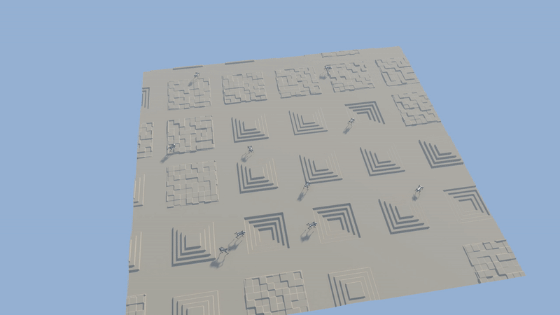
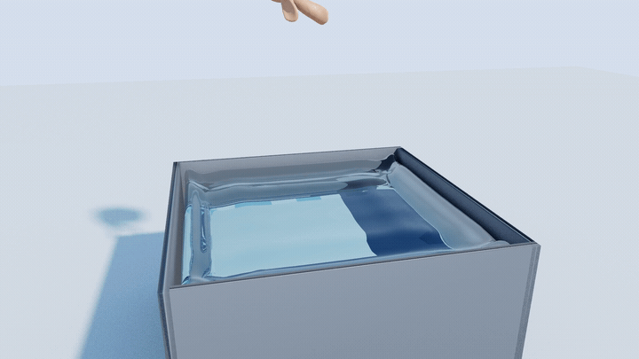

# Nuka Physics

<p align="center"><b>GPU-resident · bit-deterministic · differentiable CUDA physics for robotics &amp; large-scale RL.</b><br>
<sub>Self-written end to end — no external physics or rendering SDK.</sub></p>

<p align="center">
  
  
  
  
</p>

<p align="center">
  <a href="https://github.com/kry4r/Nuka-Physics/raw/master/docs/media/go2_climb_terrain.mp4"></a>
</p>
<p align="center"><sub>10 RL-trained Go2 <b>climb / descend / cross</b> procedural terrain on <b>one general contact solver</b> — rendered by the self-written CUDA path tracer. <a href="https://github.com/kry4r/Nuka-Physics/raw/master/docs/media/go2_climb_terrain.mp4">▶ full 1080p video</a></sub></p>

<p align="center">
  <a href="https://github.com/kry4r/Nuka-Physics/raw/master/docs/media/bunny_water_drop.mp4"></a>
</p>
<p align="center"><sub>A heavy rigid Stanford bunny plunges into a <b>two-way MLS-MPM water pool</b> — crown splash, central jet, radiating ripples, then sinks and rests — through the <b>same general body↔particle coupling</b>, rendered by the self-written CUDA path tracer. <a href="https://github.com/kry4r/Nuka-Physics/raw/master/docs/media/bunny_water_drop.mp4">▶ full 1080p video</a></sub></p>

## Why Nuka

- **One GPU, thousands of articulated envs.** The same cooked world template steps thousands of environments GPU-resident — the substrate for large-scale RL.
- **Strong (D1) determinism.** No FP atomics, fixed reduction order everywhere — re-running from the same inputs reproduces results *byte-for-byte* (enforced by a physics-smell lint on every PR).
- **Differentiable.** A real analytical reverse-mode adjoint through rigid + articulated (Featherstone) dynamics — not a stop-gradient contact approximation. `jax.grad` and `loss.backward()` agree to engine round-off.
- **One general contact path.** Robot↔ground and robot↔object are the same contact problem and run the same solver — no per-scene fast-paths.
- **Self-written, no SDK.** CUDA solver, hand-written MJCF/URDF/USD importers, and a self-written CUDA two-level path tracer for offline beauty.

## Architecture

```
 scene (.usda/.xml/.urdf/.nks)
   → SceneIR  (compose · edit · settle)
   → CookToModel  → nk::Model   (cooked constant tables, one general contact family)
   → nk::World    (GPU-resident: Model uploaded once, Data arena, solve schedule)
   → Pipeline     (fixed-order op list: AABB → LBVH → narrowphase → rows → solve → integrate)
   → Step  (CUDA backend, PHI dispatch)        → Render  (Vulkan raster · CUDA path tracer)
```

| Module | Role |
|---|---|
| `nk` | Engine core — `Model` (cooked tables), `Data` (device arena), `Pipeline`, `World` (steppable), solve schedule (islands/coloring) |
| `phi` | Backend abstraction + `backend_cuda` (all CUDA op kernels + the RT path) |
| `collision` / `constraint` | LBVH broadphase, GJK/EPA + heightfield narrowphase, contact-row data model |
| `scene` | Scene IR, ECS, `.nks`/`.nka` formats, `CookToModel`, terrain/heightfield |
| `import` | MJCF / URDF / text-USD importers + cookers (XPBD, fluid, SDF) |
| `diffsim` | Reverse-mode adjoint: tape, checkpointing, ABA-reverse, IFT contact gradient, self-written sparse solvers |
| `render` / `rt` | Vulkan rasterizer (realtime) + CUDA two-level path tracer (offline beauty) |
| `codegen` | Generated forward/adjoint kernels (XPBD distance/bend/volume/shape-match, Cosserat, SDF) |
| `sensor` | Contact-wrench/ray/state sensors + Philox sim-to-real noise |

**Pillars in code:** D1 determinism · self-written (no external SDK) · multi-backend PHI (CUDA today) · differentiable · ONE general contact path.

## What works today

| System | Status | Notes |
|---|---|---|
| Articulated multibody (Featherstone / ABA) | **Production** | drives the 4096-env Go2; CRBA/ABA, multi-articulation co-residence |
| Rigid + general contact | **Production** | LBVH → narrowphase → block-island PGS + split-impulse; MJX-parity tested |
| Terrain / heightfield + RL locomotion | **Production** | the climbing demo above; height-scan obs, PPO-trained |
| Soft body — XPBD (distance/bend/volume/shape-match) | Functional | cloth + 3D tet; two-way coupled to rigid through the general solver; Cosserat rods forward-only (no adjoint yet); tested |
| Fluid — Position-Based Fluids | Functional | density/viscosity/surface-tension; two-way coupled to rigid (foot-splash); tested |
| MLS-MPM (material point method) | Functional | grid + APIC transfer + elastic + weakly-compressible **fluid** constitutive (Tait EOS); two-way rigid↔grid coupling on the same general path (the bunny-in-water demo above); deterministic; granular (sand) in progress |
| Rigid/articulation ↔ soft / fluid / cloth (two-way) | Functional | the general row solver emits rigid↔particle coupling rows — a foot pushes cloth, splashes fluid, dents a tet; one path; tested |
| Differentiable sim (rigid + articulated) | Functional | analytical adjoint — **contact-free** path |
| Rendering | Functional | Vulkan raster + self-written CUDA path tracer (sun/shadow/AO/GI/sky) |
| RL / training | Functional | rl_games PPO, gym + Isaac-Lab-compat, zero-copy DLPack (torch/JAX) |
| Scene import | Functional | MJCF, URDF, text-USD (hand-written, no OpenUSD) |
| Sim-to-real noise | Functional | Philox4x32 sensor noise + domain randomization (off by default) |

## Toward rigid–soft–fluid coupling + multibody

The north star is **one general solver that couples rigid, soft, fluid, and articulated multibody two-way**. Honest distance today:

- ✅ **Rigid + multibody, unified.** One general PGS path resolves rigid + articulation + static sides in a single kernel (MJX-parity). This pillar is *done*.
- ✅ **Soft (XPBD cloth + 3D tet), fluid (PBF), and an MLS-MPM continuum lane step and co-reside** in one `nk::World` (shared step, density-scope isolation).
- ✅ **Rigid/articulation ↔ soft / fluid / cloth is two-way through the one solver.** The general row assembly emits rigid↔particle coupling rows, so a foot pushes cloth, splashes fluid, and dents a tet *through the solver*. MLS-MPM couples as a first-class peer: a `CouplingProvider` funnels both contact-rows and grid-transfer into one body-side reaction sink, deterministically.
- 🟡 **Polished coupled demo videos in progress** (soft-ball slam · cloth-onto-Go2 · creature-in-water-pool · Go2-on-sand); **MLS-MPM granular (sand)** is the next constitutive model.
- ❌ **Differentiability does not extend through contact / coupling** yet.

**Remaining gap:** add the MLS-MPM granular (Drucker–Prager) model for sand, land the polished coupled demo videos, then extend the adjoint through contact. The rigid + multibody + coupling spine is in; soft, fluid, and MPM all couple to it through the one path.

## Roadmap

- [x] Articulated multibody + general rigid contact (one solver)
- [x] Terrain / heightfield locomotion + in-engine RL
- [x] Soft (XPBD) and fluid (PBF) standalone + co-residence
- [x] Self-written CUDA path-tracer beauty render
- [x] **Rigid ↔ soft / fluid / cloth two-way coupling in the general solver** + rigid-coupling tests
- [x] MLS-MPM (grid + APIC + elastic) two-way coupled to rigid on the one path
- [ ] MLS-MPM granular (sand) + polished coupled demo videos (soft-slam · cloth-drape · water-pool · Go2-on-sand)
- [ ] Differentiable contact (d/dM, d/dJ) + floating-base orientation channel
- [ ] RT renderer speedup — denoiser + FP32 beauty TU (OptiX under evaluation)
- [ ] Second PHI backend (multi-backend beyond CUDA)
- [ ] PyPI wheel (`pip install nuka-physics`)

## Quick start

Built on **Linux** with **CUDA 12.8** and **g++-10**; a CUDA GPU is required for the production physics path.

```bash
export CC=gcc-10 CXX=g++-10
cmake -S . -B build-cuda128 -DNK_BUILD_TESTS=ON -DNK_REQUIRE_CUDA=ON -DNK_PHYSICS_BACKEND=CUDA
cmake --build build-cuda128 -j
pip install -e python
```

**Train Go2 locomotion (forward sim):**
```bash
CUDA_VISIBLE_DEVICES=0 python examples/training/train_go2_ppo.py --num_actors 4096
```

**Backprop through the simulator** (link-mass gradient; the full example is [system identification](docs/examples/system_identification.md)):
```python
import torch, nuka
from nuka.autograd import differentiable_rollout

with nuka.Device.create(0) as dev:
    world = nuka.World.create_from_scene(dev, "examples/scenes/go2_system_id.usda", 1)
    world.set_gravity_z(-9.81)
    tape = nuka.Tape.create(world, checkpoint_interval=3, max_tape_entries=4096,
                            max_checkpoints=512, recompute_on_backward=1)
    mass = torch.nn.Parameter(torch.tensor([0.9], device="cuda"))   # one thigh link
    actions = torch.zeros(30, world.base_link_count - 1, device="cuda")
    obs = differentiable_rollout(world, tape, actions, params=mass,
                                 param_link_indices=[2], obs="qdot")
    obs.pow(2).mean().backward()
    print("dLoss/dmass =", mass.grad.item())
    tape.destroy(); world.destroy()
```
The differentiable path is single-env and contact-free; build a fresh world+tape per evaluation (cheap).

## Documentation

- [Getting started](docs/getting-started.md) · [Architecture](docs/concepts/architecture.md) · [Differentiable simulation](docs/concepts/diff-sim.md) · [Migrating from Isaac Lab](docs/concepts/isaaclab-compat.md)
- Examples: [Go2 locomotion](docs/examples/go2_locomotion.md) · [System identification](docs/examples/system_identification.md)
- Deep dives: [runtime](docs/architecture/runtime-overview.md) · [diff-sim tape](docs/architecture/diffsim-tape.md) · [scene compiler](docs/architecture/scene-compiler.md)

## Scene import

Imports **MJCF** (`.xml`), **URDF**, and **text USD** (`.usda`). The `.usda` parser is hand-written using only the C++ standard library — no OpenUSD dependency, no binary `.usdc`/`.usdz`. See [NOTICE](NOTICE).

## Contributing &amp; License

Contributions welcome; see [CONTRIBUTING.md](CONTRIBUTING.md) and the [Code of Conduct](CODE_OF_CONDUCT.md). Security: [SECURITY.md](SECURITY.md).

**Dual-licensed: [AGPL-3.0](LICENSE) (open source) or a commercial license** for closed-source / proprietary use. See [LICENSING.md](LICENSING.md) and [NOTICE](NOTICE).
