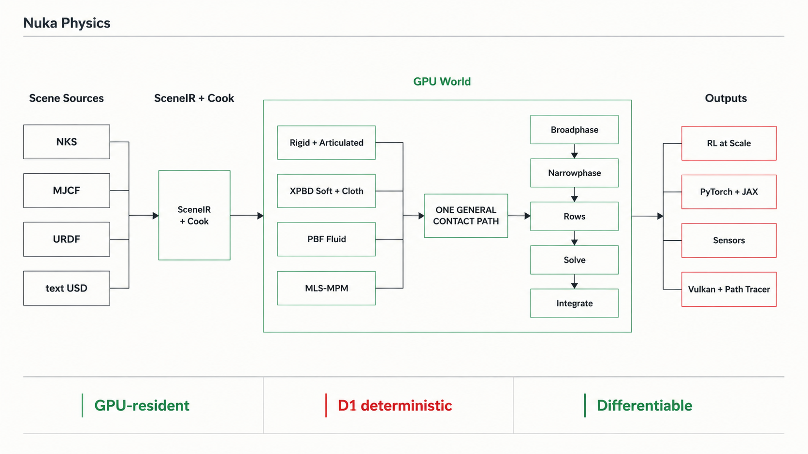

# Architecture

Nuka Physics is a C++/CUDA engine with a stable C ABI and thin Python bindings.
Scenes are compiled once, simulation state remains on the GPU, and a fixed
operation schedule advances one or thousands of environments.



## Design rules

- **GPU-resident production path.** CUDA owns simulation state and execution.
  CPU implementations are reference and validation tools, never a silent
  production fallback.
- **D1 determinism.** Physics kernels use fixed ordering and avoid
  floating-point atomics so identical inputs reproduce bit-for-bit.
- **Batched by model.** Immutable cooked tables are shared while each
  environment owns independent mutable state.
- **One contact architecture.** Rigid, articulated, particle, deformable, and
  continuum systems meet at shared contact-row and body-reaction boundaries.
- **Explicit ownership.** Authoring, cooking, execution, readout, and rendering
  are separate layers with narrow data contracts.

## Scene to GPU

```text
NKS / MJCF / URDF / text USD
              |
              v
           SceneIR
              |
              v
       CookSceneToModel
        /            \
  nk::Model        SceneMap
      |                |
      v                v
  nk::World       RenderWorld
      |
      v
  nk::Pipeline -> ordered PHI operations -> GPU state
```

1. Importers normalize source formats into `scene::SceneIR`.
2. `scene::cook::CookSceneToModel` resolves bodies, articulations, shapes,
   media, materials, terrain, and capacities into immutable `nk::Model` tables.
3. `SceneMap` preserves the relationship between authored entities and cooked
   rows for rendering and tooling.
4. `nk::World` uploads the model, allocates the mutable `nk::Data` arena, seeds
   initial state, and owns the executable `nk::Pipeline`.
5. PHI dispatches the fixed operation list to the CUDA backend.

`.nks` is the scene manifest used by current demos; paired `.nka` files carry
packed assets. MJCF, URDF, and text USD can also enter the
same cooker. Binary `.usdc` and `.usdz` are not supported.

## Simulation pipeline

The exact operation list is derived from the cooked model, but the data flow is
stable:

```text
state
  -> broadphase / candidate pairs
  -> narrowphase / contact streams
  -> universal constraint and coupling rows
  -> deterministic scheduling and solve
  -> articulation and particle/continuum updates
  -> integration
  -> sensors, tensor views, and rendering
```

Rigid and articulated dynamics use the same model and world as XPBD cloth,
soft bodies, cables, PBF fluid, and MLS-MPM media. A `CouplingProvider` connects
cross-system contacts to the shared row scheduler and body-side reaction sink;
media-specific constitutive updates remain inside their own operators.

## Core objects

| Object | Responsibility |
|---|---|
| `scene::SceneIR` | Canonical authoring representation produced by importers and composition |
| `nk::Model` | Immutable cooked tables, capacities, topology, materials, and schedules |
| `nk::Data` | Mutable device arena for poses, velocities, rows, particles, grids, and readouts |
| `nk::Pipeline` | Fixed ordered list of backend operations for one model |
| `nk::World` | Lifetime boundary combining model, data, pipeline, stepping, reset, and buffer access |
| `phi::Device` / `phi::OpCall` | Backend-neutral device ownership and operation dispatch |
| `SceneMap` / `RenderWorld` | Authored-to-cooked mapping and render-facing scene state |

## Repository map

| Area | Modules |
|---|---|
| Engine model and execution | `src/nk`, `src/phi`, `src/runtime` |
| Scene import and cooking | `src/scene`, `src/import` |
| Contacts and solve | `src/collision`, `src/constraint`, `src/solver` |
| Differentiation and generated kernels | `src/diffsim`, `src/codegen` |
| Sensors and rendering | `src/sensor`, `src/render`, `src/rt` |
| Stable integration boundary | `src/include/nuka`, `src/c_abi` |
| Python bindings and authoring | `python/nuka`, `python/nuka/author` |
| RL adapters and tasks | `python/nuka/gym`, `python/nuka/isaaclab_compat`, `python/nuka/tasks` |

## Public integration layers

- The C ABI in `src/include/nuka` is the stable embedding surface.
- Nanobind exposes device, world, scene-builder, sensor, rendering, and buffer
  APIs through `python/nuka`.
- DLPack aliases engine buffers into PyTorch or JAX without host copies.
- `nuka.author.Scene` is the high-level simulation assembler. Geometry,
  constitutive material, appearance, and control remain separate inputs.
- `nuka.gym` and `nuka.isaaclab_compat` build RL environments on the same world
  and buffer contracts; they do not implement a second simulator.

## Extending the engine

New formats should terminate at `SceneIR`. New physical systems should declare
their model/data storage, emit pipeline operations, and join the shared contact
and coupling contracts. New backends implement PHI operations without changing
the public world API. Scene-specific solver branches and implicit CPU fallback
are outside the architecture.
