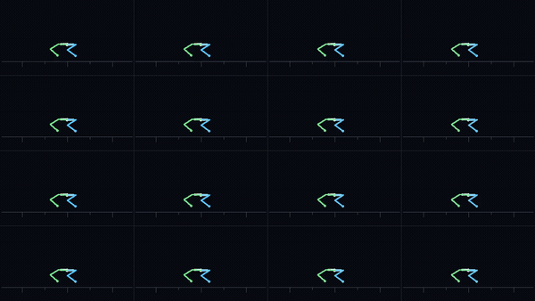

# Example: 4096-env Go2 locomotion (v0.3 forward RL)



This is the v0.3 showcase: a Unitree Go2 quadruped learning a command-conditioned
walking gait, with **4096 environments running in parallel on a single GPU** from
one cooked world template. The policy is trained from scratch with rl_games PPO.

> **This is a forward-simulation + RL-training result, not the differentiable
> path.** The gradient does *not* produce the gait — PPO does. The differentiable
> simulation showcase is the separate
> [system-identification demo](system_identification.md). Keep the two distinct.

## What it demonstrates

- 4096 parallel articulated environments on one GPU, all sharing one cooked
  template, with GPU-resident broadphase, contact generation, PGS contact/joint
  solve, Featherstone ABA, and PD drives.
- Strong (D1) determinism by default — bit-identical re-runs.
- An in-engine RL stack: zero-copy PyTorch (DLPack) buffer views, a gymnasium
  vec-env, an rl_games adapter, and an engine-side per-env reset primitive.
- A command-conditioned gait: forward-velocity tracking across `-0.5 … +1.0 m/s`.

The GIF shows 16 of the 4096 environments (a debug-skeleton render of the
headless batched path).

## Reproducing the training

Training is **single-GPU only** — always set `CUDA_VISIBLE_DEVICES=0`. The
launcher loads `examples/training/go2_ppo_cfg.yaml`, registers the on-GPU Nuka
env with rl_games, and runs the PPO loop.

```bash
# Full run (4096 actors, the v0.3 config):
CUDA_VISIBLE_DEVICES=0 python examples/training/train_go2_ppo.py --num_actors 4096

# Tiny launch proof (3 epochs @ 256 actors) — verifies the stack launches and
# begins training, NOT convergence:
CUDA_VISIBLE_DEVICES=0 python examples/training/train_go2_ppo.py --smoke
```

Useful CLI overrides (all optional): `--max_epochs`, `--horizon_length`,
`--minibatch_size`, `--mini_epochs`, `--seed`, `--command VX VY WYAW`,
`--experiment-name`. The launcher prints per-epoch reward/loss metrics to stdout
so a headless run shows progress.

> `minibatch_size` must divide `horizon_length * num_actors`; the launcher checks
> this up front with a clear error.

## Files

- `examples/training/train_go2_ppo.py` — the launcher (same script drives the
  full run and the `--smoke` launch proof).
- `examples/training/go2_ppo_cfg.yaml` — the rl_games config.
- `examples/scenes/go2_locomotion.usda` — the Go2 locomotion scene.

## Prerequisites

The C++ engine must be built (`build-cuda128`) and the Python bindings installed
(`pip install -e python`) — see [getting started](../getting-started.md). PPO
training additionally needs `torch` and `rl_games`.

## Performance context

On a development GPU (an RTX 4000 Ada — roughly 3× below a 4090) the 4096-env
step is comfortably under the 1 ms / env-step target. At 4096-env production
batches the step is compute-bound, so launch-overhead optimizations (e.g. the
opt-in, bit-exact CUDA-graph step path) are determinism-preserving mechanisms
rather than speedups. The absolute master-plan step-time gate is validated on a
reference RTX 5080 — see
[the v0.3 test & perf report](../architecture/2026-05-31-v03-test-and-perf-report.md).
