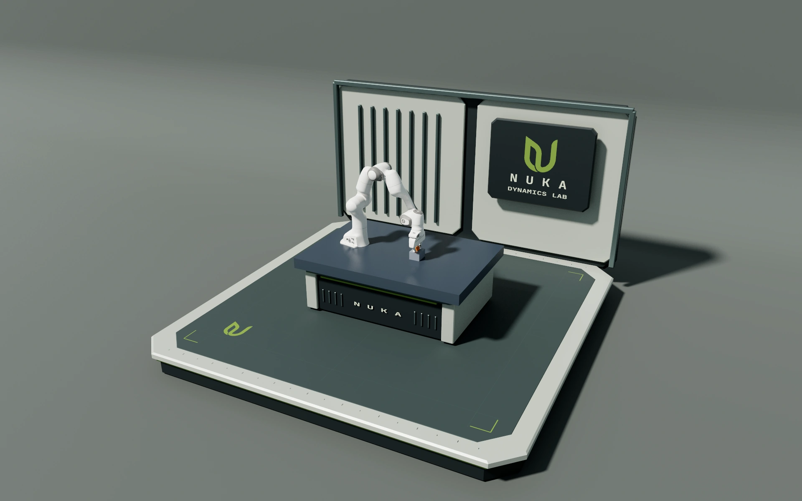

# Nuka Dynamics Lab assets

Nuka Dynamics Lab is an editable NKS environment with a layered measurement deck, warm grey back panels, graphite equipment housings, avocado green edges and inset signage. The gripper layout has a 2.5 m work deck, with the cabinet and backboard centered on the physical bench.



This preview uses a saved gripper pose. Physics measurements belong to the capture that produced the motion. Existing gallery recordings retain their recorded environment and physics.

## Asset files

| File | Contents |
| --- | --- |
| [appearance.nks](../examples/assets/nuka_lab/appearance.nks) | Shared PBR materials, sky colors, ambient illumination and beauty settings |
| [gripper.nks](../examples/assets/nuka_lab/gripper.nks) | Full-size lab, equipment cabinet, overview and contact cameras |
| [bunny.nks](../examples/assets/nuka_lab/bunny.nks) | Impact layout, 5 cm grid, overview and close cameras |
| [compression.nks](../examples/assets/nuka_lab/compression.nks) | Compression layout, 2.5 cm grid and overview camera |
| [lab_geometry.nka](../examples/assets/nuka_lab/lab_geometry.nka) | Shared triangle meshes, including bevels, signs and the seamless backdrop |

Each layout imports `appearance.nks` and references meshes in `lab_geometry.nka`. Panels, frames, signs, lamps and cabinet parts are named visual nodes. Their positions and rotations are editable in the NKS tree. Units are metres; quaternions use `[w, x, y, z]`.

Materials are defined in NKS and referenced by name. For example, edit the shared green in `appearance.nks`:

```json
"avocado": {
  "base_color": [0.23, 0.34, 0.095, 1],
  "roughness": 0.48,
  "metallic": 0.12
}
```

`base_color` and `emissive` use linear RGB. The environment's `sky.background` is a normalized display RGB clear color. `sky.fill` controls indirect sky illumination. Each layout authors its directional key light, cameras and `environment.shadow` bounds. Adjust those bounds to cover the action when changing the layout.

Each camera's `focus_distance` locates its target along local -Z. A positive `shadow_radius` fits the shadow map around that target for detailed views; zero inherits the environment's bounds. These distances use metres.

The shared `environment.shadow` settings expose `map_size` in pixels, `strength` from zero to one, `bias` in normalized shadow depth and `filter_radius` as PCF sample spacing in texels. Layouts override the coverage center and radius while inheriting these quality settings. Keep contact cameras focused on the working area: using the entire lab's shadow coverage for a centimetre-scale close-up produces visible square shadow pixels.

## Render integration

Load the asset through the ordinary NKS loader. Build the simulation's studio scene with `add_default_floor = false` because the asset supplies its own floor:

```cpp
#include <filesystem>
#include "render/scene_asset.hpp"
#include "render/studio_beauty.hpp"
#include "scene/format/nks.hpp"

const std::filesystem::path path = "examples/assets/nuka_lab/gripper.nks";
const auto environment = nuka::scene::nks::Load(path.string());
const auto asset = nuka::render::BuildSceneRenderAsset(
    environment, path.parent_path().string());

auto studio = nuka::render::BuildStudioScene(
    physics_scene.Ecs(), scene_map, surface_topologies, width, height, false);
nuka::render::UseAuthoredSceneMaterials(studio);
nuka::render::RenderAssetBinding binding;
nuka::render::SetSceneRenderAsset(studio.world, binding, asset);
nuka::render::ApplySceneLighting(studio.options, asset);
nuka::render::ApplySceneCamera(studio.options, asset, "three-quarter");
```

The renderer receives ordinary meshes, materials and lights. There is no Nuka-specific geometry builder in C++. `SetSceneRenderAsset` can reload material, mesh and transform edits into the same slots without changing physics pose bindings or deforming surface indices. Rebuild the render scene when the asset's topology or node count changes.

The render attachment accepts static visuals. Physical bodies, collision surfaces, joints and media use the normal scene cooking path. Keep decorative geometry clear of the simulated motion. A render asset's cabinet does not provide physical support.

## Render a saved capture

```bash
build-linux/tests/nuka_robot_elastoplastic_demo \
  --replay out/elastoplastic/gripper \
  --environment examples/assets/nuka_lab/gripper.nks \
  --out-dir out/elastoplastic/gripper_front \
  --overview front --width 1280 --height 800 --samples 128
```

All three elastoplastic demos accept `--environment path/to/layout.nks`. The gripper's `--overview` selects the authored `three-quarter`, `front` or `top` camera; `close` supplies its separate contact view. The bunny uses `overview` and `close`; compression uses `overview`. `--render-stride` selects frames for inspection.

For the gripper, `--renderer rt` uses ray tracing and `--renderer raster` uses Vulkan rasterization. Both consume the same recorded states and asset meshes. `--samples` controls ray-traced sampling. Each render saves a flattened `render_environment.nks` and companion NKA in its output directory, preserving the appearance used for that recording.

## Rebuild the modeled geometry

The offline [asset builder](../tools/media/build_nuka_lab.py) models the beveled parts and converts [the Nuka logo](media/nuka-logo.png) and the bundled JetBrains Mono typeface into sign meshes. It requires NumPy and Pillow:

```bash
python tools/media/build_nuka_lab.py
```

The builder recreates the three layouts and their shared mesh library. Keep customized layouts under separate names before regenerating. It leaves `appearance.nks` unchanged; materials remain authored in NKS. Loading the finished assets needs no Python, font rasterizer or Blender runtime.

Keep raw frames, local scene variants and intermediate encodes in `out/` or `.nuka-runs/`. Publish curated assets and checked previews with their capture provenance.
